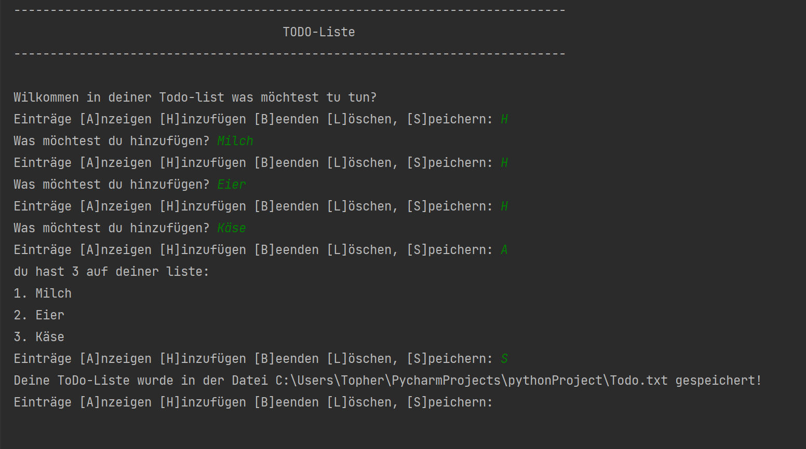
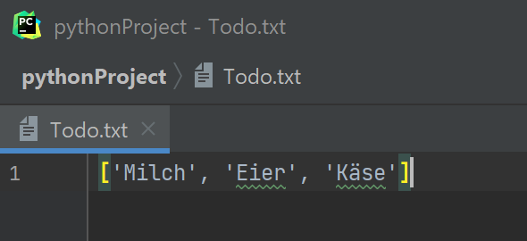

# Projekt 4.2: Eine existierende Todo-Liste auslesen

Diese Übung basiert auf den Übungen https://github.com/Oberschule-an-der-Egge/python-04 und https://github.com/Oberschule-an-der-Egge/python-04.01. Es wird empfohlen beide Übungen zu absolvieren, bevor die hier vorliegende Übung angegangen wird.


##Dateien aufrufen.

Um in Python mit einer Datei arbeiten zu können, ist es notwendig den vollständigen Dateipfand als String vorliegen zu haben. Wie man den Dateipfad Betriebssystemunabhängig auslesen aknn, wurde in https://github.com/Oberschule-an-der-Egge/python-04.01 erläutert.


##Dateien mit Inhalt erstellen.


Um Dateien zu schreiben nehmen wir `open()` und den Kontextmanager `with .. as ..:`

```python
with open(dateipfad, "w") as datei_out:
    datei_out.write("Beliebiger String")
    
    # text -> ['Zeile eins\n', 'Zeile zwei\n', ...]
```

Beachten Sie, dass die Methode `open` zwei Argumente fordert: Zum einen den Dateipfad als string; zum anderen das Argument `"w"`.


##Probieren Sie es aus!

Versuchen Sie zunächst eine Textdatei mit beliebiegen Inhalt zu erstellen. Welchen Unterschied macht es, wenn Sie bei `open` statt des Arguments `"w"` das Argument `a` verwenden?


##Wenden Sie das erlernte an!

Versuchen Sie nun die in https://github.com/Oberschule-an-der-Egge/python-04 erstellte ToDo-Liste wie folgt zu erweitern:



Nach dem beenden des Beispielprogramms sollte eine Textdatei entstanden sein, die wie folgenden Inhalt hat.:



#Achtung: `datei_out.write` fordert als Argument einen String. Sollten Sie eine Liste Speichen wollen, müssen Sie diese erst umwandeln.


##Vorbereitung für die nächste Übung

Um die Datei laden zu können, ist es sinnvoll die Listeneinträge einzeln untereinander in Ihrer Ausgabedatei zu speichern. Dies gelingt am einfachsten mittels einer Schleife.
-> Wandeln Sie Ihren Quellcode so ab, dass ihre `Todo.txt` nicht dies:

`['Milch', 'Eier', 'Käse']`

sondern dies enthält:

```
Milch
Eier
Käse
```

